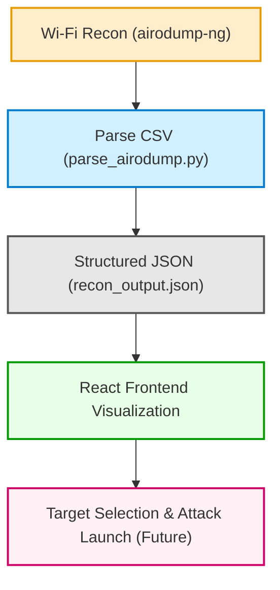

## 🦢 Black Swan — Wi-Fi Reconnaissance & Visualization Tool

Black Swan is a full-stack project designed to bring BloodHound-style visualization to wireless reconnaissance.
It parses airodump-ng CSV output, maps Access Points (APs) and connected clients, and prepares a structured dataset for interactive visualization and attack orchestration.

## 🔑 Key Features

- **CSV → JSON Parsing:** Python script converts raw airodump-ng CSV into clean, structured JSON.

- **Client-AP Mapping:** Automatically links stations to their associated APs.

- **Frontend-Ready:** Outputs data ready for React-based visualization.

- **Extensible Design:** Future integration with FastAPI backend and attack modules (handshake capture, deauth, PMKID, Evil Twin).

- **Red Team Focus:** Built for reconnaissance and adversary simulation workflows.

